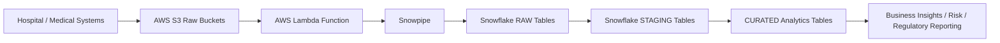

# Medical Data Engineering Portfolio: Patient Records, Claims, Treatments (Automated Ingestion)

> End-to-end step-by-step guide for building a medical data warehouse using AWS S3, Snowflake, Snowpipe, and Lambda with automated ingestion.

This README provides:
1. **Numbered execution steps**
2. **Sample CSV files**
3. **One-page flow diagram**
4. **Full explanations of all SQL scripts**
5. **Automated ingestion using Snowpipe + Lambda**

---

## 🧭 Project Overview

We are building a **medical data platform** for:
- Patient records
- Medical claims
- Treatments and procedures

Architecture with automation:



**Explanation:**
- Lambda triggers whenever a new CSV file is uploaded to S3.
- Snowpipe automatically loads the new file into Snowflake RAW tables.
- STAGING and CURATED layers process data for analytics and reporting.

---

## 📌 Numbered Execution Steps

### 1. Setup AWS S3 Buckets
- `medical-raw-patients`
- `medical-raw-claims`
- `medical-raw-treatments`
- Upload initial sample CSV files.

**Purpose:** Secure raw data storage.

---

### 2. Sample CSV Files

#### 2.1 patients.csv
```
patient_id,first_name,last_name,date_of_birth,gender,city,province
PAT001,John,Doe,1980-01-01,M,Johannesburg,Gauteng
PAT002,Jane,Smith,1990-06-15,F,Cape Town,Western Cape
PAT003,Bob,Johnson,1975-03-10,M,Durban,KZN
```

#### 2.2 claims.csv
```
claim_id,patient_id,claim_type,claim_date,claim_amount,status
CLM001,PAT001,HOSPITAL,2025-06-05,5000,PAID
CLM002,PAT002,OUTPATIENT,2025-06-06,1500,PAID
CLM003,PAT001,PHARMACY,2025-06-07,200,PAID
```

#### 2.3 treatments.csv
```
treatment_id,patient_id,procedure,procedure_date,cost,department
TRT001,PAT001,Surgery,2025-06-01,5000,Cardiology
TRT002,PAT002,Physiotherapy,2025-06-02,1500,Rehabilitation
TRT003,PAT003,Checkup,2025-06-03,200,General
```

**Purpose:** Testing ingestion and transformations.

---

### 3. Snowflake Database Setup
```sql
CREATE DATABASE MEDICAL_DW;
CREATE SCHEMA MEDICAL_DW.RAW;
CREATE SCHEMA MEDICAL_DW.STAGING;
CREATE SCHEMA MEDICAL_DW.CURATED;
```
**Explanation:**
- RAW: original data
- STAGING: cleaned, standardized
- CURATED: analytics-ready

---

### 4. Define CSV File Format & External Stages
```sql
CREATE OR REPLACE FILE FORMAT medical_csv_format
TYPE = CSV
SKIP_HEADER = 1
FIELD_DELIMITER = ','
NULL_IF = ('NULL','');

CREATE OR REPLACE STAGE medical_patient_stage
URL = 's3://medical-raw-patients/'
FILE_FORMAT = medical_csv_format;

CREATE OR REPLACE STAGE medical_claim_stage
URL = 's3://medical-raw-claims/'
FILE_FORMAT = medical_csv_format;

CREATE OR REPLACE STAGE medical_treatment_stage
URL = 's3://medical-raw-treatments/'
FILE_FORMAT = medical_csv_format;
```
**Explanation:**
- Snowflake reads CSVs consistently
- Stages point to S3 buckets

---

### 5. Create RAW Tables
```sql
CREATE OR REPLACE TABLE RAW.PATIENTS_RAW (
    patient_id STRING,
    first_name STRING,
    last_name STRING,
    date_of_birth DATE,
    gender STRING,
    city STRING,
    province STRING,
    ingestion_ts TIMESTAMP DEFAULT CURRENT_TIMESTAMP
);

CREATE OR REPLACE TABLE RAW.CLAIMS_RAW (
    claim_id STRING,
    patient_id STRING,
    claim_type STRING,
    claim_date DATE,
    claim_amount NUMBER(14,2),
    status STRING,
    ingestion_ts TIMESTAMP DEFAULT CURRENT_TIMESTAMP
);

CREATE OR REPLACE TABLE RAW.TREATMENTS_RAW (
    treatment_id STRING,
    patient_id STRING,
    procedure STRING,
    procedure_date DATE,
    cost NUMBER(14,2),
    department STRING,
    ingestion_ts TIMESTAMP DEFAULT CURRENT_TIMESTAMP
);
```
**Explanation:** Stores all raw medical data.

---

### 6. Create Snowpipe for Automated Loading
```sql
CREATE OR REPLACE PIPE MEDICAL_DW.RAW.PATIENTS_PIPE
AUTO_INGEST = TRUE
AS COPY INTO RAW.PATIENTS_RAW
FROM @medical_patient_stage
FILE_FORMAT = medical_csv_format;

CREATE OR REPLACE PIPE MEDICAL_DW.RAW.CLAIMS_PIPE
AUTO_INGEST = TRUE
AS COPY INTO RAW.CLAIMS_RAW
FROM @medical_claim_stage
FILE_FORMAT = medical_csv_format;

CREATE OR REPLACE PIPE MEDICAL_DW.RAW.TREATMENTS_PIPE
AUTO_INGEST = TRUE
AS COPY INTO RAW.TREATMENTS_RAW
FROM @medical_treatment_stage
FILE_FORMAT = medical_csv_format;
```
**Explanation:** Snowpipe automatically loads new CSVs.

---

### 7. Configure AWS Lambda Trigger
1. Create Lambda function in AWS Console.
2. Add code to call Snowpipe REST API on S3 upload.
3. Set trigger for object creation in each S3 bucket.
**Explanation:** Fully automates ingestion from S3 to Snowflake.

---

### 8. STAGING Tables
```sql
CREATE OR REPLACE TABLE STAGING.PATIENTS_CLEAN AS
SELECT *, UPPER(city) AS city_upper FROM RAW.PATIENTS_RAW;

CREATE OR REPLACE TABLE STAGING.CLAIMS_CLEAN AS
SELECT *, UPPER(claim_type) AS claim_type_clean FROM RAW.CLAIMS_RAW WHERE claim_amount >= 0;

CREATE OR REPLACE TABLE STAGING.TREATMENTS_CLEAN AS
SELECT *, UPPER(procedure) AS procedure_clean FROM RAW.TREATMENTS_RAW WHERE cost > 0;
```
**Explanation:** Standardizes strings, filters invalid data, prepares for analytics.

---

### 9. CURATED Tables for Analytics
```sql
CREATE OR REPLACE TABLE CURATED.PATIENT_SUMMARY AS
SELECT gender, COUNT(patient_id) AS num_patients, AVG(DATEDIFF('year', date_of_birth, CURRENT_DATE)) AS avg_age
FROM STAGING.PATIENTS_CLEAN
GROUP BY gender;

CREATE OR REPLACE TABLE CURATED.CLAIM_SUMMARY AS
SELECT claim_type_clean, COUNT(claim_id) AS num_claims, SUM(claim_amount) AS total_claims
FROM STAGING.CLAIMS_CLEAN
GROUP BY claim_type_clean;

CREATE OR REPLACE TABLE CURATED.TREATMENT_SUMMARY AS
SELECT department, COUNT(treatment_id) AS num_treatments, SUM(cost) AS total_cost
FROM STAGING.TREATMENTS_CLEAN
GROUP BY department;
```
**Explanation:** Aggregates patient counts, claim totals, treatment costs by department.

---

# ✅ Summary of Automation

| Component | Role |
|-----------|------|
| AWS S3 | Stores raw CSVs, triggers Lambda |
| AWS Lambda | Calls Snowpipe REST API to load new files |
| Snowpipe | Automatically copies files into RAW tables |
| STAGING & CURATED | Provides cleaned, analytics-ready data |

This README sets up a **fully automated medical data warehouse** with Snowpipe and Lambda, suitable for analytics, reporting, and regulatory purposes.

